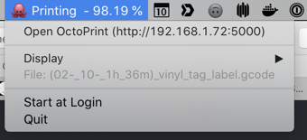

# Gopherprint


Simple menubar app to display Octprint status and progress.



## Table of Contents

- [Install](#install)
  - [Dependencies](#dependencies)
- [Maintainers](#maintainers)
- [License](#license)

## Install

Add your host and API key in a file `Makefile.vars`:

```make
SERVER_URL=http://localhost:5000
API_KEY=...
```

Then build and install the app with `make install`, that will create Gopherprint.app

```shell
$ make build
```

### Dependencies

- [caseymrm/menuet](https://github.com/caseymrm/menuet)
- [mcuadros/go-octoprint](https://github.com/mcuadros/go-octoprint)
- [haklop/gnotifier](https://github.com/haklop/gnotifier)

## Maintainer(s)

- [@thibmaek](https://github.com/thibmaek)

## License

MIT

For more info, see [license file](./LICENSE)
